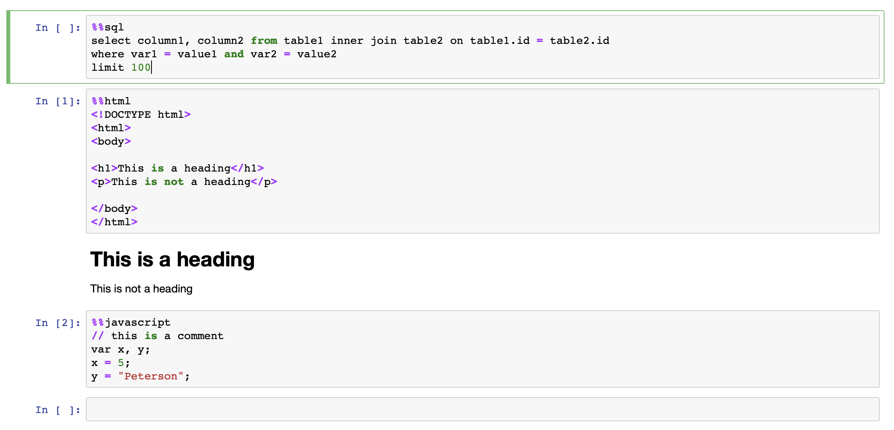
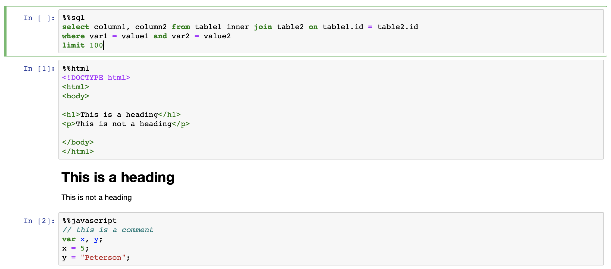

# notebook_magiclight

[](https://notebook-magiclight.readthedocs.io/en/latest/?badge=latest)

[](https://travis-ci.org/wRosie/notebook_magiclight)


# Motivation
Cell magics in Jupyter Notebook is a popular way to expand the functionality of the notebook. However, sometimes the syntax highlighting of the magic commands remains the default IPython highlighting.

The project aims to provide syntax highlighting for the statements in magic cells. It will automatically detect what magics are used in the notebook, and search for an available [codemirror syntax highlighting](https://codemirror.net/mode/index.html). 

# Get Started 
To get started, clone the repo to your favorite spot and install the extension:

```
jupyter nbextension install /path_to_the_repo/notebook_magiclight
```

Then you will have to enable the extension by:

```
jupyter nbextension enable notebook_magiclight/index
```

And you are good to go! No more ugly magic cells!

# Demo
Before installing the extension, your magic cells probably look like this:

Some cell magics may have built in syntax highlighting, depending on your default settings.

But most of them could look like a mess because they are using the default IPython highlighting.


The notebook_magiclight extension will automatically detect the cell magics you use, and apply the correct syntax highlighting to them.


The syntax highlight also updates when typing, just like any other properly highlighted code blocks.


# Future development
This v0.1 only supports block magics that starts with "%%". I will implement inline magic soon.
